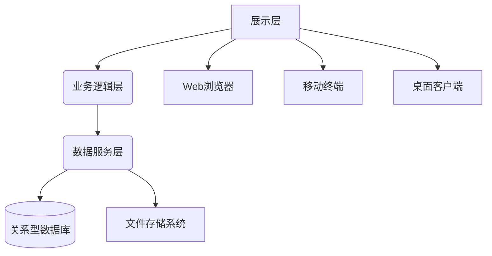
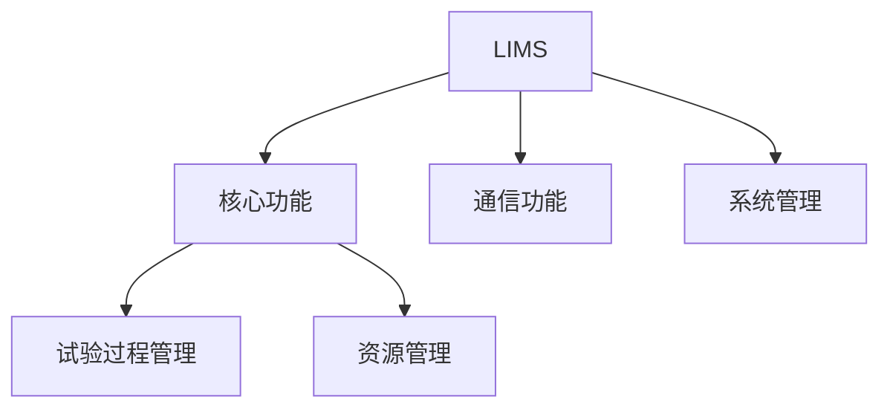

# 产品需求文档（PRD）

## 1. 引言

### 1.1 文档目的
本PRD依据GB/T 40343-2021《智能实验室 信息管理系统 功能要求》标准制定，旨在为LIMS系统开发提供完整的功能需求和技术规范。

### 1.2 范围
本系统应满足标准第5-10章规定的核心功能要求，包含：
- 试验过程管理（第7章）
- 资源管理（第7.2章）
- 通信功能（第9章）
- 系统管理（第10章）

### 1.3 术语与定义
| 术语 | 定义（依据标准第3章） |
|------|---------------------|
| LIMS | 通过获取、分析、报告、存储等手段，对实验室活动数据进行管理的计算机系统 |
| 工作流 | 工作从开始到完成的过程，由流程逻辑和路线规则组成 |

### 1.4 缩略语
| 缩写 | 全称 |
|------|------|
| LIMS | 实验室信息管理系统 |
| ERP | 企业资源计划系统 |

## 2. 产品概述

### 2.1 系统架构

### 2.2 功能架构

## 3. 功能需求

### 3.1 核心功能

#### 3.1.1 试验过程管理（标准7.1）

##### 3.1.1.1 委托登记（标准7.1.1）

**描述**: 支持多源任务接入方式，实现智能化合同评审，管理样品信息及影像资料，实时反馈任务状态。

**用户故事**:
作为实验室管理员，我需要通过多种方式接收试验任务，自动完成合同评审，以便高效管理试验流程。

**优先级**: P0 (核心功能)

**验收标准**:

- **场景1: Web表单任务登记**
  Given 用户通过Web表单提交试验任务
  When 填写完整样品信息和试验要求
  Then 系统生成唯一任务编号并自动触发合同评审

- **场景2: Excel批量导入**
  Given 用户上传符合模板的Excel文件
  When 文件包含5个以上试验任务
  Then 系统自动解析并创建所有任务记录

- **场景3: 合同评审通过**
  Given 任务信息符合预设规则
  When 系统自动评审完成
  Then 状态变更为"已通过"并通知客户

- **场景4: 合同评审不通过**
  Given 样品存储条件不符合试验要求
  When 系统自动评审完成
  Then 状态变更为"需修改"并提示具体原因

- **场景5: 影像资料上传**
  Given 用户登记任务时
  When 上传样品实物照片
  Then 系统关联影像与任务编号并生成缩略图

**依赖**: 无

##### 3.1.1.2 任务分配（标准7.1.2）

**描述**: 实现试验任务的智能分配机制，支持自动规则分配与人工调配双模式，确保任务高效执行。

**用户故事**:
作为质量主管，我需要根据试验类型和人员资质快速分配任务，并监控执行进度，以保证实验室高效运转。

**优先级**: P0 (核心功能)

**验收标准**:

- **场景1: 自动分配成功**
  Given 新到检测任务符合自动分配规则
  When 系统接收试验任务
  Then 自动匹配资质人员并在5分钟内完成分配

- **场景2: 人工调配任务**
  Given 遇到复杂检测项目
  When 主管手动选择试验人员
  Then 系统记录调配原因并更新任务状态

- **场景3: 分配要素审核**
  Given 分配方案包含人员/设备/周期
  When 提交审核
  Then 系统校验资质匹配性并提示冲突

- **场景4: 任务重新分配**
  Given 原检测人员突发状况
  When 主管重新分配任务
  Then 系统保留原始分配记录并新建任务版本

**依赖**: 3.1.1.1 委托登记

##### 3.1.1.3 数据录入（标准7.1.3-7.1.5）

**描述**: 实现试验数据全流程管理，涵盖采集、处理、审核环节，确保数据完整性和可追溯性。

**用户故事**:
作为检测工程师，我需要准确记录试验数据并及时发现异常，以保证检测结果的可靠性。

**优先级**: P0 (核心功能)

**验收标准**:

- **场景1: 设备自动采集**
  Given 连接符合标准的检测设备
  When 启动数据采集流程
  Then 系统自动记录带时间戳的原始数据

- **场景2: 异常数据处理**
  Given 检测到超出阈值的数值
  When 系统自动报警
  Then 标记异常数据并通知责任人

- **场景3: 审核流程触发**
  Given 完成数据预处理
  When 提交审核请求
  Then 自动推送至三级审核队列

- **场景4: 数据版本追溯**
  Given 需要查看历史数据
  When 选择特定时间节点
  Then 显示完整数据处理历程

**依赖**: 3.1.1.2 任务分配

##### 3.1.1.4 报告编制

**描述**: 根据试验数据自动生成检测报告，支持自定义模板和版本控制。

**用户故事**:
作为报告编制员，我需要根据模板自动生成报告并记录修改历史，以便提高报告编制效率。

**优先级**: P0 (核心功能)

**验收标准**:
- **场景1: 报告自动生成**
  Given 试验数据审核通过
  When 选择报告模板
  Then 系统自动填充样品信息和试验结果

- **场景2: 手动修改报告**
  Given 自动生成的报告
  When 人工修改报告内容
  Then 系统记录修改人和修改内容

**依赖**: 3.1.1.3 数据录入

##### 3.1.1.5 报告审核

**描述**: 实现报告的多级审核流程，确保报告内容的准确性和合规性。

**用户故事**:
作为质量审核员，我需要高效审核报告内容并标记问题，以保证报告质量符合标准要求。

**优先级**: P0 (核心功能)

**验收标准**:
- **场景1: 报告送审**
  Given 报告编制完成
  When 提交审核请求
  Then 系统自动推送至审核队列

- **场景2: 在线批注**
  Given 打开待审核报告
  When 添加审核意见
  Then 系统实时标记问题位置

- **场景3: 版本对比**
  Given 报告多次修改
  When 选择历史版本
  Then 高亮显示内容差异

**依赖**: 3.1.1.4 报告编制

##### 3.1.1.6 报告批准

**描述**: 提供电子化报告批准流程，确保报告的法律效力和安全性。

**用户故事**:
作为批准主管，我需要安全地签署报告并添加防伪标识，以保证报告的合法性和真实性。

**优先级**: P0 (核心功能)

**验收标准**:
- **场景1: 电子签章**
  Given 报告审核通过
  When 授权人员批准
  Then 系统附加数字证书签名

- **场景2: 权限验证**
  Given 未授权用户尝试批准
  When 点击批准按钮
  Then 系统提示"权限不足"

- **场景3: 防伪水印**
  Given 报告批准完成
  When 生成PDF版本
  Then 自动添加不可移除的水印

**依赖**: 3.1.1.5 报告审核

##### 3.1.1.7 报告发放

**描述**: 管理报告的分发过程，确保受控访问和完整追踪。

**用户故事**:
作为报告管理员，我需要安全地分发报告并记录流向，以防止信息泄露。

**优先级**: P0 (核心功能)

**验收标准**:
- **场景1: 邮件分发**
  Given 批准完成的报告
  When 选择邮件发送
  Then 系统自动加密附件并发送

- **场景2: API对接**
  Given 外部系统请求报告
  When 提供有效令牌
  Then 系统返回加密报告

- **场景3: 访问控制**
  Given 用户尝试访问报告
  When 无查看权限
  Then 系统拒绝访问并记录尝试

**依赖**: 3.1.1.6 报告批准

##### 3.1.1.8 报告归档

**描述**: 实现报告的长期安全存储，满足法规合规性要求。

**用户故事**:
作为档案管理员，我需要按标准归档报告并设置保留策略，以满足审计和法规要求。

**优先级**: P0 (核心功能)

**验收标准**:
- **场景1: 自动归档**
  Given 报告发放完成
  When 达到归档条件
  Then 系统自动移入归档库

- **场景2: 加密存储**
  Given 归档报告
  When 存储到磁盘
  Then 自动使用AES-256加密

- **场景3: 保留期限管理**
  Given 报告保存期满
  When 符合删除条件
  Then 系统自动安全删除

**依赖**: 3.1.1.7 报告发放

#### 3.1.2 资源管理（标准7.2）
##### 3.1.2.1 人员管理

**描述**: 实现实验室人员全生命周期管理，包括资质跟踪、能力评估和任务调配。

**用户故事**:
作为人力资源主管，我需要全面掌握技术人员资质状态并合理分配任务，以确保实验室运行效率。

**优先级**: P0 (核心功能)

**验收标准**:
- **场景1: 资质到期预警**
  Given 人员资质有效期临近
  When 达到预设提醒阈值
  Then 系统自动发送预警通知

- **场景2: 能力矩阵更新**
  Given 员工获得新资质
  When 管理员更新档案
  Then 系统实时同步至能力矩阵

- **场景3: 工作量分析**
  Given 需要评估团队负荷
  When 选择统计周期
  Then 生成可视化工作量报表

**依赖**: 3.1.1.2 任务分配

##### 3.1.2.2 设备管理

**描述**: 实现实验室设备全生命周期管理，包括设备信息管理、状态跟踪、维护记录和责任人分配，保障设备资源的可用性和合规性。

**用户故事**:
1. 作为设备管理员，我需要管理设备的基本信息（名称、型号、序列号等），以便准确跟踪设备资产。
2. 作为维护工程师，我需要记录设备的维护历史和状态变更，以确保设备处于可用状态。
3. 作为实验室主管，我需要查看设备使用情况和责任人信息，以便合理分配设备资源。

**优先级**: P0 (核心功能)

**验收标准**:
- **场景1: 设备信息管理**
  Given 新设备入库
  When 录入设备基本信息（名称、型号、序列号等）
  Then 系统生成唯一设备ID并保存完整信息

- **场景2: 设备状态跟踪**
  Given 设备状态发生变化（正常→维修）
  When 更新设备状态
  Then 系统记录状态变更时间和原因

- **场景3: 维护记录管理**
  Given 设备完成定期维护
  When 录入维护日期和内容
  Then 系统更新最后维护日期并关联设备记录

- **场景4: 设备分配管理**
  Given 新试验任务需要特定设备
  When 分配设备给责任人
  Then 系统记录责任人信息并标记设备为"使用中"

- **场景5: 设备查询统计**
  Given 需要查看设备使用情况
  When 按状态/类型筛选设备
  Then 系统返回设备列表及详细信息

**依赖**:
- 3.1.1.2 任务分配
- 3.1.2.1 人员管理（责任人关联）

##### 3.1.2.3 样品管理

**描述**: 实现样品从接收到处置的全流程跟踪，确保样品完整性和可追溯性。

**用户故事**:
作为样品管理员，我需要实时掌握样品位置和状态，以保证试验结果的准确性。

**优先级**: P0 (核心功能)

**验收标准**:
- **场景1: 样品接收登记**
  Given 新到样品
  When 扫描样品条码
  Then 系统自动生成唯一ID并记录接收时间

- **场景2: 存储条件告警**
  Given 样品存储温度超标
  When 持续10分钟
  Then 系统发送三级告警通知

**依赖**: 3.1.1.1 委托登记

##### 3.1.2.4 方法管理

**描述**: 管理实验室检测方法的全生命周期，确保方法合规性和适用性。

**用户故事**:
作为方法开发员，我需要维护标准方法库并验证新方法，以保证检测结果准确性。

**优先级**: P0 (核心功能)

**验收标准**:
- **场景1: 方法新增验证**
  Given 导入新检测方法
  When 完成验证测试
  Then 系统自动生成验证报告

- **场景2: 方法版本控制**
  Given 方法标准更新
  When 修订方法内容
  Then 系统保留历史版本并标注生效日期

- **场景3: 智能方法推荐**
  Given 输入样品特性
  When 查询适用方法
  Then 系统按匹配度排序推荐

**依赖**: 3.1.1.3 数据录入

##### 3.1.2.5 设施环境

**描述**: 实时监控实验室环境参数，保障试验条件符合检测要求，实现绿色节能管理。

**用户故事**:
作为实验室安全员，我需要实时掌握环境参数和设备状态，以确保试验环境安全合规。

**优先级**: P0 (核心功能)

**验收标准**:
- **场景1: 环境参数告警**
  Given 温湿度超出标准范围
  When 持续超过5分钟
  Then 系统触发三级告警并通知负责人

- **场景2: 安全设施异常**
  Given 消防系统故障
  When 检测到异常信号
  Then 系统锁定关联区域并启动应急预案

- **场景3: 能效分析**
  Given 需要优化能耗
  When 选择统计周期
  Then 生成分项能耗对比报表

**依赖**: 3.1.1.2 任务分配

### 3.2 通信功能（标准第9章）

#### 3.2.1 仪器设备通信接口
1. 支持RS485、TCP/IP、蓝牙等多种通信协议
2. 实现与实验室设备的双向数据交互
3. 通信异常自动报警机制
4. 数据采集频率可配置（1s-24h）

#### 3.2.2 外部系统集成
1. ERP系统对接（SAP/Oracle等）
2. MES系统数据交换
3. 第三方检测平台API对接
4. 数据加密传输（AES-256）

### 3.3 系统管理（标准第10章）

#### 3.3.1 用户管理

**描述**: 实现实验室人员账户的全生命周期管理，保障系统访问安全性和合规性。

**用户故事**:
作为系统管理员，我需要精细控制用户访问权限并及时禁用离职账户，以防止未授权访问。

**优先级**: P0 (核心功能)

**验收标准**:
- **场景1: 账户自动禁用**
  Given 员工离职
  When HR系统同步离职状态
  Then 系统自动禁用账户并回收权限

- **场景2: 密码强度验证**
  Given 用户修改密码
  When 不符合复杂度要求
  Then 系统拒绝修改并提示规则

- **场景3: 多因素认证**
  Given 高风险操作请求
  When 登录敏感功能模块
  Then 强制触发二次认证

**依赖**: 3.3.2 权限控制

#### 3.3.2 权限控制

**描述**: 实现基于角色和字段的精细化权限管理体系，保障系统操作合规性和数据安全性。

| 角色        | 任务登记 | 数据修改 | 报告签发 | 系统配置 |
|------------|---------|---------|---------|---------|
| 实验员     | ✔       | ✖       | ✖       | ✖       |
| 质量主管   | ✔       | ✔       | ✔       | ✖       |
| 系统管理员 | ✔       | ✔       | ✔       | ✔       |

**用户故事**:
作为质量主管，我需要精确控制不同岗位的数据访问权限，以满足实验室质量管理要求。

**优先级**: P0 (核心功能)

**验收标准**:
- **场景1: 角色权限变更**
  Given 新增检测岗位角色
  When 配置权限模板
  Then 系统自动应用至关联用户

- **场景2: 字段级权限测试**
  Given 实验员尝试修改报告
  When 点击保存按钮
  Then 系统拦截并提示"无修改权限"

- **场景3: 审计日志验证**
  Given 执行关键操作
  When 查看操作日志
  Then 记录完整操作轨迹（用户/IP/时间）

**依赖**: 3.3.1 用户管理

#### 3.3.3 系统安全
1. 数据库加密存储（TDE）
2. 防SQL注入/XSS攻击
3. 病毒防护接口（对接杀毒软件）
4. 数据备份策略（每日增量+每周全量）

#### 3.3.4 系统设置

**描述**: 提供灵活的系统配置能力，支持实验室业务流程个性化定制。

**用户故事**:
作为配置管理员，我需要根据实验室需求调整工作流程和报告格式，以提升业务适配性。

**优先级**: P1 (重要功能)

**验收标准**:
- **场景1: 流程节点调整**
  Given 新增审批环节
  When 拖拽配置工作流
  Then 新流程即时生效

- **场景2: 多语言切换**
  Given 切换英文界面
  When 刷新系统
  Then 所有菜单文案更新为英文

- **场景3: 模板版本回滚**
  Given 报告模板更新出错
  When 选择历史版本
  Then 成功恢复至稳定版本

- **场景4: 组织架构同步**
  Given 企业HR系统更新部门结构
  When 执行数据同步
  Then LIMS自动更新组织树

- **场景5: 模板字段级配置**
  Given 编辑报告模板
  When 添加自定义字段
  Then 新字段即时生效于报告生成

**依赖**: 3.3.3 系统安全

#### 3.3.5 日志管理

**描述**: 实现全系统操作和异常的可审计追踪，满足合规性要求和故障排查需求。

**用户故事**:
作为审计员，我需要快速检索历史操作记录和分析系统异常，以完成定期安全审计。

**优先级**: P1 (重要功能)

**验收标准**:
- **场景1: 操作日志查询**
  Given 需要追溯数据修改记录
  When 输入时间范围和用户
  Then 显示完整操作链（增删改查）

- **场景2: 异常日志分析**
  Given 系统发生未知错误
  When 查看异常日志
  Then 获取堆栈跟踪和上下文信息

- **场景3: 日志归档导出**
  Given 需要长期保存日志
  When 选择归档时间范围
  Then 生成符合规范的PDF审计报告

**依赖**: 3.3.3 系统安全

#### 3.3.6 系统监控
1. 实时资源监控（CPU/内存/存储）
2. 服务健康状态看板
3. 自动告警通知（邮件/短信）

## 4. 非功能需求

### 4.1 性能指标
| 指标         | 要求值 | 测试方法 |
|-------------|-------|---------|
| 并发用户数   | ≥200  | JMeter压测 |
| 响应时间     | ≤2s   | 90%百分位 |
| 数据吞吐量   | 500TPS | 持续1小时 |

## 5. 附录

### 5.1 标准引用对照表
| 本PRD章节 | GB/T 40343-2021条款 |
|----------|--------------------|
| 3.1.1    | 7.1                |
| 3.2.1    | 9.1                |
| 3.3.1    | 10.2               |